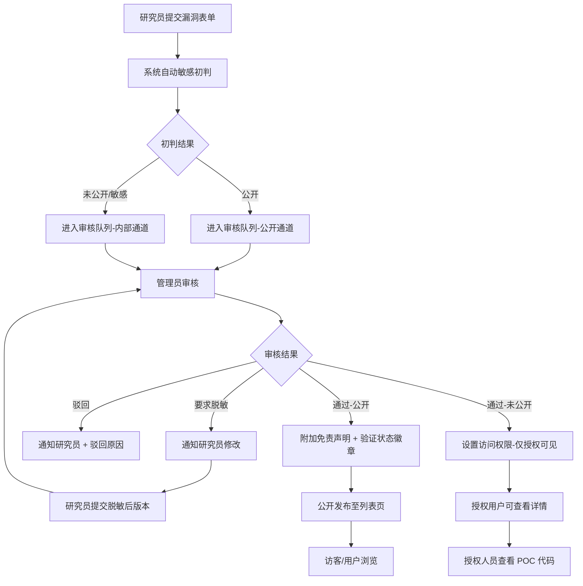

## 1. 产品概述
安全漏洞 POC（Proof of Concept）收录台是面向安全研究员、渗透测试人员和企业安全团队的漏洞知识库管理平台。平台用于规范化收录、审核、存储和分发漏洞验证代码与修复方案，解决漏洞信息不对称、敏感信息泄露和修复参考缺失等核心问题。

- 目标用户：安全研究员（提交者）、授权安全人员（阅读者）、平台管理员（审核者）
- 产品价值：构建安全可控的漏洞知识共享生态，推动漏洞修复与防护能力建设

## 2. 核心功能

### 2.1 用户角色

| 角色 | 注册/获取方式 | 核心权限 |
|------|--------------|----------|
| 安全研究员 | 平台注册 + 身份审核 | 提交漏洞 POC、查看本人提交记录、响应脱敏要求 |
| 授权人员 | 管理员审批授权 | 浏览公开漏洞、查看未公开漏洞详情、下载 POC 代码 |
| 普通访客 | 无需登录 | 仅浏览公开漏洞列表（不含 POC 代码）、查看免责声明 |
| 平台管理员 | 系统预设 | 审核提交内容、判断敏感级别、要求脱敏代码、管理用户授权、发布/下架条目 |

### 2.2 功能模块

1. **首页/漏洞列表页**：搜索筛选、漏洞卡片展示、敏感级别标签、验证状态徽章
2. **漏洞提交页**：多字段表单、POC 代码编辑器、文件附件上传、自动敏感初判
3. **漏洞详情页**：完整信息展示、验证流程时间线、免责声明、授权访问控制、脱敏对比视图
4. **审核工作台**：待审核列表、敏感级别重判定、脱敏要求下发、发布/驳回操作
5. **个人中心**：我的提交、授权状态、操作日志

### 2.3 页面详情

| 页面名称 | 模块名称 | 功能描述 |
|----------|----------|----------|
| 漏洞列表页 | 顶部导航栏 | Logo、角色切换、登录入口、搜索框 |
| 漏洞列表页 | 筛选面板 | 敏感级别筛选、验证状态筛选、影响组件搜索、时间范围筛选 |
| 漏洞列表页 | 漏洞卡片流 | 漏洞编号、CVE 标识、影响版本标签、敏感级别色块、验证状态徽章、提交时间 |
| 漏洞提交页 | 表单主体 | 漏洞编号输入、影响版本多字段、复现条件文本域、修复建议富文本、POC 代码块编辑器 |
| 漏洞提交页 | 敏感初判 | 基于关键词/正则自动识别高危特征（RCE、SQLi、0day 标识等），给出建议级别 |
| 漏洞详情页 | 信息区块 | 漏洞概要、技术细节、影响范围分析、时间线记录 |
| 漏洞详情页 | 访问控制 | 未公开条目显示授权提示，管理员可要求脱敏后显示 POC 代码 |
| 漏洞详情页 | 免责声明 | 固定底部警示栏："本平台 POC 仅供授权安全研究使用，严禁非法用途" |
| 审核工作台 | 审核队列 | 待审核/待脱敏/已发布状态 Tab、批量操作 |
| 审核工作台 | 审核面板 | 敏感级别下拉（公开/内部/机密/绝密）、脱敏要求编辑、驳回原因输入 |
| 个人中心 | 我的提交 | 提交列表 + 审核状态流转 |
| 个人中心 | 授权管理 | 申请高级权限、查看当前授权范围 |

## 3. 核心流程

研究员登录后进入提交页面，填写漏洞编号、影响版本、复现条件、修复建议并粘贴 POC 代码。系统基于关键词库自动进行敏感级别初判，标记为可能未公开的条目直接进入审核队列。管理员在审核工作台对内容进行复核，可调整敏感级别、要求研究员对 POC 中硬编码的 IP、凭证、利用参数进行脱敏处理。脱敏通过后，公开条目自动附加免责声明和验证状态徽章对外展示；未公开条目仅授权人员可凭权限查看详情和下载 POC。访客浏览公开列表时，POC 代码区域显示"登录并验证身份后查看"的占位提示。

## 4. 界面设计

### 4.1 设计风格

- **主色调**：深色科技风，以 `#0B0F1A`（深空黑）为背景底色，搭配 `#00D4AA`（赛博青绿）作为主操作色，强调安全行业严谨专业的调性
- **辅助色**：敏感级别色彩系统 — 公开 `#22C55E`（绿）、内部 `#EAB308`（黄）、机密 `#F97316`（橙）、绝密 `#EF4444`（红）
- **按钮风格**：直角微切角（2px 圆角），次要按钮描边风格，主按钮发光悬浮效果，危险按钮红色脉冲警示
- **字体方案**：标题使用 `JetBrains Mono` 等宽字体强化科技感，正文使用 `Inter` 保障可读性，代码块使用 `Fira Code` 带连字等宽字体
- **布局风格**：左右分栏式仪表盘布局，左侧固定导航 + 右侧内容区，卡片采用细描边 + 微内阴影，营造"控制台"氛围
- **图标风格**：线性简约图标，敏感级别使用盾牌/锁/警告等语义化图形，状态使用实色圆点徽章

### 4.2 页面设计概览

| 页面名称 | 模块名称 | UI 元素 |
|----------|----------|----------|
| 漏洞列表页 | 顶部导航栏 | 深色背景、发光 Logo、搜索框带扫描线动画、角色徽章 |
| 漏洞列表页 | 漏洞卡片流 | Grid 3 列布局、卡片悬停时边框发光 + 轻微上浮、敏感级别色块居左竖条 |
| 漏洞列表页 | 筛选面板 | 胶囊式筛选按钮、激活态青绿光晕 |
| 漏洞提交页 | 代码编辑器 | 深色代码主题、行号、语法高亮、字符计数、粘贴检测提示 |
| 漏洞提交页 | 敏感初判面板 | 右侧浮动卡片、实时分析进度条、风险关键词高亮标记 |
| 漏洞详情页 | 信息区块 | 标题带 CVE 编号链接、技术细节折叠面板、时间线垂直节点 |
| 漏洞详情页 | 免责声明栏 | 页面底部固定、黄黑斜纹边、警示三角图标、文字加粗闪烁 |
| 漏洞详情页 | POC 访问控制 | 未授权时显示磨砂玻璃遮罩 + 锁图标 + 申请授权按钮 |
| 审核工作台 | 状态 Tab | 顶部横向 Tab、未读数量红色徽章、切换时内容淡入动画 |
| 审核工作台 | 审核操作栏 | 底部悬浮操作栏、三按钮并排（驳回/脱敏/通过）、确认弹窗二次验证 |

### 4.3 响应式设计

- **设计策略**：Desktop-first（桌面端优先），安全从业人员主要在工作站环境使用
- **平板适配（1024px）**：卡片流降为 2 列，右侧浮动面板改为底部堆叠
- **手机适配（640px）**：导航收起为汉堡菜单，卡片单列全宽，代码编辑器启用横向滚动模式
- **触控优化**：按钮最小触控区域 44×44px，表单字段增加垂直间距，减少长按误触发

### 4.4 交互动效

- 页面加载：卡片逐个错位淡入（stagger 60ms），背景呈现轻微网格扫描线
- 搜索交互：输入时触发顶部搜索图标旋转 360°，结果高亮关键词
- 敏感级别切换：色块边框脉冲发光一次，数字统计滚动动画更新
- POC 代码展开：从 3 行高度平滑展开至完整高度，带渐显遮罩
- 审核状态流转：时间线节点发光扩散，对应卡片边框瞬时闪烁
