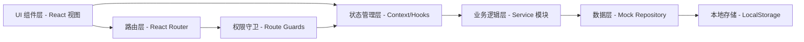
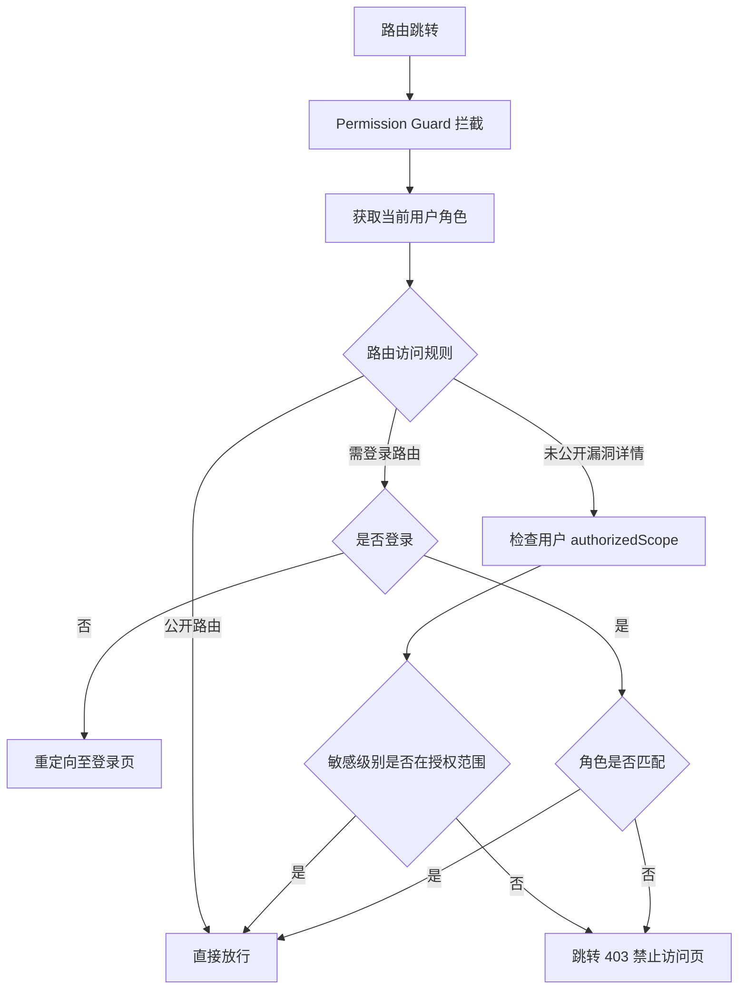
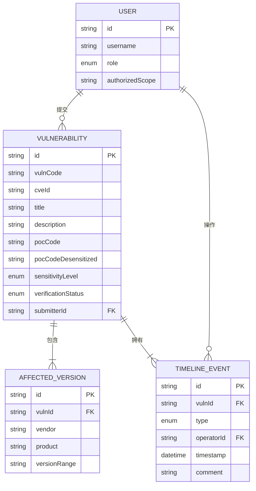

## 1. 架构设计

本项目为纯前端单页应用（SPA），采用本地状态管理 + Mock 数据模拟后端能力。架构分为 UI 层、状态层、业务逻辑层和数据层，通过 React Hooks 进行轻量级状态管理，使用 Context API 实现全局用户角色与权限状态共享。



## 2. 技术选型说明

- **前端框架**：React 18 + TypeScript，提供强类型约束与组件化开发体验
- **构建工具**：Vite 5，热更新快、打包体积小、生态成熟
- **样式方案**：TailwindCSS 3 + 自定义主题变量，配合少量 CSS-in-JS 处理复杂动效
- **路由管理**：React Router v6，支持嵌套路由与权限守卫
- **代码高亮**：Prism.js，支持多种漏洞利用脚本语法高亮
- **图标库**：Lucide React，线性简约风格图标集
- **表单处理**：React Hook Form + Zod 校验，类型安全的表单开发
- **数据持久化**：LocalStorage 封装，模拟后端数据库存储
- **Mock 数据**：项目内置 15+ 条样例漏洞数据，覆盖不同敏感级别与验证状态

## 3. 路由定义

| 路由路径 | 页面名称 | 访问权限 | 说明 |
|----------|----------|----------|------|
| `/` | 漏洞列表首页 | 所有用户 | 公开漏洞浏览、搜索筛选 |
| `/vuln/:id` | 漏洞详情页 | 所有用户（未公开条目需授权） | 完整漏洞信息、POC 代码、时间线 |
| `/submit` | 提交漏洞页 | 研究员及以上 | 漏洞 POC 表单提交 |
| `/review` | 审核工作台 | 管理员 | 审核队列、敏感级别判定、脱敏管理 |
| `/profile` | 个人中心 | 登录用户 | 我的提交、授权状态、操作日志 |
| `/login` | 登录页 | 所有用户 | 角色切换登录（模拟） |
| `/403` | 无权限页 | 所有用户 | 越权访问提示 |
| `*` | 404 页 | 所有用户 | 路由不存在 |

## 4. 核心类型定义（TypeScript）

```typescript
// 敏感级别枚举
export enum SensitivityLevel {
  PUBLIC = 'public',       // 公开
  INTERNAL = 'internal',   // 内部
  CONFIDENTIAL = 'confidential', // 机密
  TOP_SECRET = 'top_secret' // 绝密
}

// 验证状态枚举
export enum VerificationStatus {
  PENDING = 'pending',         // 待审核
  DESENSITIZATION = 'desensitization', // 待脱敏
  VERIFIED = 'verified',       // 已验证通过
  REJECTED = 'rejected'        // 已驳回
}

// 用户角色枚举
export enum UserRole {
  GUEST = 'guest',
  RESEARCHER = 'researcher',
  AUTHORIZED = 'authorized',
  ADMIN = 'admin'
}

// 漏洞提交核心实体
export interface Vulnerability {
  id: string;
  cveId?: string;                  // CVE 编号
  vulnCode: string;                // 平台内部漏洞编号
  title: string;                   // 漏洞标题
  description: string;             // 漏洞概要描述
  affectedVersions: AffectedVersion[];
  reproductionConditions: string;  // 复现条件
  repairSuggestion: string;        // 修复建议
  pocCode: string;                 // POC 源代码
  pocCodeDesensitized?: string;    // 脱敏后 POC 代码
  sensitivityLevel: SensitivityLevel;
  verificationStatus: VerificationStatus;
  submitterId: string;
  submitterName: string;
  submittedAt: string;             // ISO timestamp
  reviewedAt?: string;
  reviewerId?: string;
  reviewerName?: string;
  rejectReason?: string;
  desensitizationRequest?: string; // 脱敏要求说明
  timeline: TimelineEvent[];
  disclaimerAccepted: boolean;
}

export interface AffectedVersion {
  vendor: string;       // 厂商
  product: string;      // 产品名
  versionRange: string; // 影响版本范围
}

export interface TimelineEvent {
  id: string;
  type: 'submit' | 'review' | 'desensitize' | 'publish' | 'reject' | 'update';
  operatorName: string;
  operatorRole: UserRole;
  timestamp: string;
  comment: string;
}

export interface User {
  id: string;
  username: string;
  displayName: string;
  role: UserRole;
  email: string;
  authorizedScope?: SensitivityLevel[]; // 可查看的敏感级别范围
  createdAt: string;
}
```

## 5. 权限守卫逻辑

路由级权限通过 React Router 的 loader 机制实现，组件级权限通过 `usePermission()` 自定义 Hook 判断：



## 6. 数据模型与样例数据

### 6.1 实体关系图



### 6.2 初始 Mock 数据概览

| 数据实体 | 数量 | 分布说明 |
|----------|------|----------|
| User | 4 | guest / researcher / authorized / admin 各 1 个预设账号 |
| Vulnerability | 16 | 公开 6 条、内部 4 条、机密 3 条、绝密 3 条；含 CVE-2024、CVE-2023 真实编号样例 |
| AffectedVersion | 24 | 每条漏洞 1-3 个受影响版本，覆盖 Apache、Spring、Nginx 等常见组件 |
| TimelineEvent | 60+ | 每条漏洞 3-5 个时间线节点 |

### 6.3 敏感级别自动初判关键词库

前端提交时实时扫描 POC 代码与描述文本，命中以下特征自动提升建议敏感级别：

| 关键词/正则 | 命中后的建议级别 | 匹配示例 |
|-------------|-----------------|----------|
| `0day|0-day|0日|未公开|Nday` | TOP_SECRET（绝密） | "本漏洞为 0day，厂商未披露" |
| `RCE|远程命令|命令执行|代码执行|rce` | CONFIDENTIAL（机密） | `Runtime.getRuntime().exec()` |
| `SQL注入|SQLi|union select|sqlmap` | CONFIDENTIAL（机密） | `' UNION SELECT NULL--` |
| `webshell|菜刀|蚁剑|冰蝎|大马|小马` | TOP_SECRET（绝密） | 上传 webshell 后门代码 |
| `CVE-202[45]-\d{4,}` | INTERNAL（内部） | 较新 CVE 编号自动提高一级 |
| `硬编码|password|passwd|secret|凭证|token` | 触发脱敏提醒 | 要求研究员脱敏处理 |
